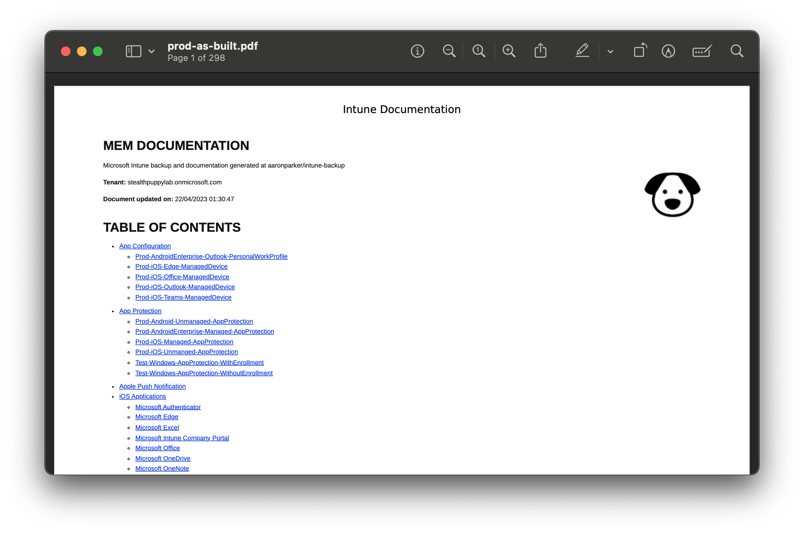

# Automated Microsoft Intune backup and as-built

A template repository that you can clone to enable a Microsoft Intune tenant backup and as-built report using [IntuneCD](https://github.com/almenscorner/IntuneCD) and [md-to-pdf](https://github.com/simonhaenisch/md-to-pdf).

To learn how to use this repository, see these articles:

- [Automate Microsoft Intune As-Built Documentation on GitHub](https://stealthpuppy.com/automate-intune-documentation-github/)
- [Automate Microsoft Intune As-Built Documentation on Azure DevOps](https://stealthpuppy.com/automate-intune-documentation-azure/)

## Example report

The generated as-built documentation will look something like:

## GitHub

After creating a new repository in GitHub based on this template, you'll need to enable the Actions to run via the repository settings, and add the secrets required by the workflows.

This template repository includes the following workflows:

* [`intune-backup.yml`](.github/workflows/intune-backup.yml) - performs the export from the Intune tenant to create a backup, and generates a markdown version of the as-built document, and tags the release
* [`intune-release.yml`](.github/workflows/intune-release.yml) - generates PDF and HTML versions of the markdown document, creates a release, and adds the documents to the release as assets
* [`remove-releases.yml`](.github/workflows/remove-releases.yml) - prunes the release assets to keep the last 60 releases

## Azure DevOps

Clone this repository into GitHub or Azure DevOps, then import into a project and create a pipeline:

* [`intune-backup.yml`](.devops/intune-backup.yml) - performs the export from the Intune tenant to create a backup, and generates a markdown version of the as-built document, and tags the release, generates PDF and HTML versions of the markdown document, creates a release, and adds the documents to the release as assets
